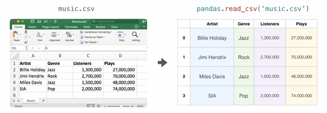
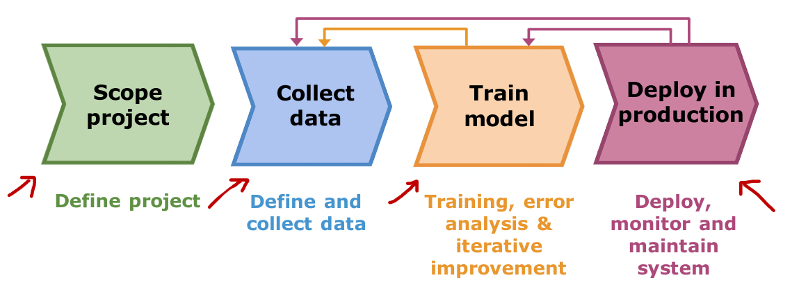

1. 一些常用的函数
    ``` python
    a = np.array([1, 2, 3, 4],
                [5, 6, 7, 8],
                [9, 10, 11, 12])
    ```
    > a.ndim --> 2
    > a.shape --> (3, 4)  // a tuple of non-negative integers
    > len(a.shape) == a.ndim --> true
    > a.size --> 12
    > a.size == math.prod(a.shape) --> True
    > a.dtype --> dtype('int64')

2. Create a basic array
    > np.zeros(2) --> array([0. , 0. ])
    > np.ones(2) --> array([1. , 1. ])
    > np.empty(2) --> array([3.14, 42. ]) 
    > // may vary depends on the state of memory
    > np.arange(4) --> array([0, 1, 2, 3])
    > np.arange(2, 9, 2) --> array([2, 4, 6, 8])
    > // first number, last number, step size
    > np.linspace(0, 10, num=5) --> array([0. , 2.5, 5. , 7.5, 10. ])
    > np.eye(2) --> array(\[[1., 0.][0., 1.]])

3. Specifying data type
    默认的数据类型是 floating point(np.float64)， 使用 dtype 来选择特定的数据类型。
    > np.ones(2, dtype=np.int64) --> array([1, 1])

4. Adding, removing, and sorting
    **在所有的axis参数中，axis表示沿着哪个方向移动**
    ```pyton
    arr = np.array([2, 1, 5, 3, 7, 4, 6, 8])
    ``` 
    sort
    > np.sort(arr) --> array([1, 2, 3, 4, 5, 6, 7, 8])
    > // 注意这个sort不是直接对于arr进行排序，而是先复制了arr然后再进行排序，arr本身数据的顺序没有改变！
    > np.argsort(arr) --> array([1, 0, 3, 5, 2, 6, 4, 7])
    > np.searchsorted([11, 12, 13, 14, 15], [-10, 20, 12, 13]) --> array([0, 5, 1, 2])
    > np.partition([7, 1, 7, 7, 1, 5, 7, 2, 3, 2, 6, 2, 3, 0]) --> array([0, 1, 2, 1, 2, 5, 2, 3, 3, 6, 7, 7, 7, 7])
    > // 相当于 [0, 1, 2, 1], [2], [5, 2, 3, 3, 6, 7, 7, 7, 7]

    concatenate
    ```python
    a = np.array([1, 2, 3, 4])
    b = np.array([5, 6, 7, 8])
    ```
    > np.concatenate((a, b)) --> array([1, 2, 3, 4, 5, 6, 7, 8])

5. Array-like
   Numpy 能把 array-like 对象自动转换为数组

    - python 原生序列（比如列表、元祖，设置是他们的嵌套[[1, 2], (3, 4)]
    - 标量数字：单独传一个5进去，会被当成零维数组。
    - 实现了 __ $array()$ __ 魔法方法的对象

6. Reshape an array
   ```python
   a = np.arange(6)
   ```
   > a.reshape(3, 2) --> array(\[[0, 1], [2, 3], [4, 5]])

7. Convert a 1D array in 2D array
   ```python
   a = np.array([1, 2, 3, 4, 5, 6])
   row_vector = a[np.newaxis, :]
   col_vector = a[:, np.newaxis]
   b = np.expend_dims(a, axis=1)
   c = np.expend_dims(a, axis=0)
   ```
   > a.shape = (6,)
   > row_vector.shape --> (1, 6)
   > col_vector.shape --> (6, 1)
   > b.shape --> (6, 1)
   > c.shape --> (1, 6)

8. Indexing
    ```python
    a = np.array([[1, 2, 3, 4], [5, 6, 7, 8], [9, 10, 11, 12]])
    five_up = (a > 2) & (a < 11)
    b = np.nonzero(a < 5)
    ```
    > print(c) --> [3 4 5 6 7 8 9 10]
    > print(b) --> (array[0, 0, 0, 0], array[0, 1, 2, 3])

9. Create an array from existing data
    ```python
    a = np.array([1, 2, 3, 4, 5, 6, 7, 8, 9, 10])
    arr1 = a[3:8]

    a1 = np.array([[1, 1], [2, 2]])
    a2 = np.array([[3, 3], [4, 4]])

    x = np.arange(1, 25).reshape(2, 12)
    ```
    > arr1 --> array([4, 5, 6, 7, 8])
    > np.vstack((a1, a2)) --> array(\[[1, 1], [2, 2], [3, 3], [4, 4]])
    > np.hstack((a1, a2)) --> array(\[[1, 1, 3, 3], [2, 2, 4, 4]])
    > np.hsplit(x, 3) // 返回一个列表，按照行拆分的三个数组

10. Basic array operations
    ```python
    a = np.array([1, 2, 3, 4])
    b = np.array([[1, 1], [2, 2]])
    ```
    > a.sum() --> 10
    > b.sum(axis=0) -> array([3, 3])
    > b.sum(axis=1) -> array([2, 4])

    ```python
    a = np.array([20, 30, 40, 50])
    b = np.arange(4)

    A = np.array([[1, 1], [0, 1]])
    B = np.array([[2, 0], [3, 4]])

    c = np.arange(12).reshape(3, 4)
    ```
    > b**2 --> array([0, 1, 4, 9])
    > 10 * np.sin(a) --> array([9.12945251, -9.88031624,  7.4511316 , -2.62374854])
    > A * B --> array(\[[2, 0], [0, 4]]) // 对应位置的元素相乘
    > A @ B --> array(\[[5, 4], [3, 4]]) // 相当于 A.dot(B)，矩阵乘法 
    > c.cumsum(axis=1) // 按照列方向的累计和

11. Broadcasting 广播机制
    - 准则一：右对齐原则：把两个数组的shape元祖拿出来比较，靠右对齐
    - 准则二：兼容性检查（满足两个条件之一）：
        1. 两个维度的长度完全相等
        2. 两个维度中，有且只有一个的长度是1

12. Other array operations
    ```python
    a = np.array([[0.45053314, 0.17296777, 0.34376245, 0.5510652],
              [0.54627315, 0.05093587, 0.40067661, 0.55645993],
              [0.12697628, 0.82485143, 0.26590556, 0.56917101]])
    ```
    > a.sum() --> 4.8595784
    > a.min() --> 0.05093587
    > a.min(axis=0) --> array([0.12697628, 0.05093587, 0.26590556, 0.5510652 ])
    > a.std() --> 标准差
    > a.mean() --> 平均值
    > a.ptp() --> 极差($Range = Max - Min$)

    **函数 np.c_**
    ```python
    a = np.array([1, 2, 3])
    b = np.array([4, 5, 6])
    ```
    > np.c_[a, b] --> array(\[[1, 4], [2, 5], [3, 6]]) //合并一维数组
    > np.c_[1:4, 4:7] --> array(\[[1, 4], [2, 5], [3, 6]]) //支持 slice 操作

    **函数 np.tile(A, reps)**
    > A: 想要重复的基础数组
    > reps: 一个数字或者元组，用来指定在各个维度上重复的次数，如果是数字，表示在最后一个维度上重复对应的次数，如果是元组，比如（2, 3）则是在行方向重复2次，在列方向重复3次

    **函数 np.linalg.norm(x, ord=None, axis=None)**
    > 计算向量或矩阵的范数(norm)
    > x 为要计算的数组
    > ord 为范数的类型 默认为L2范数

13. Generate random numbers
    ```python 
    rng = np.random.default_rng()
    ```
    > rng.random() --> 0.06369197489564249 // 随机产生
    > rng.standard.normal(10) // 产生10个由单位高斯正态分布产生的数字，组成数组
    > rng.integers(low=0, high=10, size=5) // 产生由五个在[0, 10)范围的整数组成的数组

    默认情况下，在不提供种子的情况下，default_rng 将从操作系统的不确定数据中为 RNG 提供种子，因此每次都会生成不同的数字。
    使用 Secrets.randbits 获取任意128位数字，来确保种子的独一性
    ```python
    secrets.randbits(128)
    ``` 
    一些其他的生成随机数的方式
    ```python
    a = np.random.random_sample(4)
    b = np.random.random(4)
    c = np.random.rand(4)
    ```
    这三种方法均等效

14. Get unique items and counts
    ```python
    a = np.array([11, 11, 12, 13, 14, 15, 15, 17, 12, 13, 11, 14, 18, 19, 20])
    unique_values, indices_list = np.unique(a, return_index=True)
    unique_values, occurrence_count = np.unique(a, return_counts=True)

    a_2d = np.array([[1, 2, 3, 4], [5, 6, 7, 8], [9, 10, 11, 12], [1, 2, 3, 4]])
    ```
    > np.unique(a) --> array([11, 12, 13, 14, 15, 16, 17, 18, 19, 20])
    > indices_list --> array([0, 2, 3, 4, 5, 6, 7, 12, 13, 14])
    > occurrence_count --> array([3, 2, 2, 2, 1, 1, 1, 1, 1, 1])
    > np.unique(a_2d) --> array([1, 2, 3, 4, 5, 6, 7, 8, 9, 10, 11, 12])
    > // 如果没有传递axis,2D数组将会被展平

15. Transpose and reshape a matrix 转置和重塑矩阵
    ```python
    arr = np.arange(6).reshape((2, 3))
    ```
    > arr --> array(\[[0, 1, 2], [3, 4, 5]])
    > arr.transpose() --> array(\[[0, 3], [1, 4], [2, 5]])
    > arr.T --> array(\[[0, 3], [1, 4], [2, 5]])

16. Reverse an array
    ```python
    arr = np.array([1, 2, 3, 4, 5, 6, 7, 8])
    arr_2d = np.array([[1, 2, 3, 4], [5, 6, 7, 8], [9, 10, 11, 12]])
    ```
    > np.flip(arr) --> array([8, 7, 6, 5, 4, 3, 2, 1])
    > np.flip(arr_2d) --> array(\[[12, 11, 10, 9], [8, 7, 6, 5], [4, 3, 2, 1]])
    > np.flip(arr_2d, axis=0) --> array(\[[9, 10, 11, 12], [5, 6, 7, 8], [1, 2, 3, 4]])
    > np.flip(arr_2d, axis=0) --> array(\[[4, 3, 2, 1], [8, 7, 6, 5], [12, 11, 10, 9]])

17. Reshape and flatten multidimensional arrays 重塑和展平多维数组
    ```python 
    x = np.array([[1, 2, 3, 4], [5, 6, 7, 8], [9, 10, 11, 12]])
    ```
    > x.flatten() --> array([1, 2, 3, 4, 5, 6, 7, 8, 9, 10, 11, 12])
    > // 使用 flatten 生成的新数组的变化不会影响父数组
    > // 使用 ravel 会影响父数组
    ```python
    a2 = x.ravel()
    a2[0] = 98
    ```
    > x --> array(\[[98, 2, 3, 4], [5, 6, 7, 8], [9, 10, 11, 12]])
    > a2 --> array([98, 2, 3, 4, 5, 6, 7, 8, 9, 10, 11, 12])

18. Save and load Numpy objects
    ```python
    a = np.array([1, 2, 3, 4, 5, 6])
    np.save('filename', a)
    b = np.load('filename.npy')

    csv_arr = np.array([1, 2, 3, 4, 5, 6, 7, 8])
    np.savetxt('new_file.csv', csv_arr)
    ```
    > np.loadtxt('new_file.csv') --> array([1., 2., 3., 4., 5., 6., 7., 8.])

19. Import and export a CSV
    使用 Pandas
    ```python
    import pandas as pd
    x = pd.read_csv('music.csv', header=0).values 
    x = pd.read_csv('music.csv', usecols=['Artist', 'Plays']).values
    ```
    

20. 一些运算模式：

    - Numpy在处理np.dot(矩阵，一维向量)时，会进行自动升维运算和自动降维返回，运算的时候发现后面是一个(n,)的一位数组，为了满足矩阵乘法，会在内部把它临时当作(n, 1)的列向量参与运算；算完之后将得到的(m, 1)的二维列向量展评成为(m,)的一维数组

## Linear Regression
Loss/Cost function 表示当前参数的值产生的预测值与目标值的差值的平方的均值
通过 Cost function 对于参数进行有限次迭代更新，使得造成的预测损失尽可能的小，目前已知的可以采用梯度下降来求解

但是仅仅是预测误差：
$$
    J(w, b) = \frac{1}{2m}\sum_{i = 1}^{m}(f_{w, b}(x^{(i)}) - y^{(i)})^2
$$
如果不加干预，模型可能为了让这个误差无限逼近于0导致过拟合，因此我们采用 **正则化(regularization)** 来进行处理，常见的正则化方式有：
- L2正则化(Ridge): $\frac{\lambda}{2m}\sum^{n}_{j=1}w_j^2$
- L1正则化(Lasso): $\frac{\lambda}{2m}\sum^{n}_{j=1}|w_j|$
    

### Univariate Regression
通过梯度下降来寻找最优参数：
$$
    \frac{\partial J(w, b)}{\partial w} = \frac{1}{m}\sum_{i=0}^{m-1}(f_{w, b}(x^{(i)}) - y^{(i)})x_j^{(i)}
$$
$$
    \frac{\partial J(w, b)}{\partial b} = \frac{1}{m}\sum_{i=0}^{m-1}(f_{w, b}(x^{(i)}) - y^{(i)})
$$
### Mutiple Linear Regression
学会使用向量化(vertorization)来简化 code,同时借助Numpy的并行计算优势加快代码的运行速度
### 特征缩放和学习率
当多变量的变化范围相差较大时，对于梯度的计算会产生很大的影响，因此我们需要对于变量的进行归一化处理,常见的归一化处理有：
- Max normalization
- Mean normalization
    $$
        x_{i} = \frac{x_{i} - \mu_{i}}{max-min}
    $$
- Z-score normalization
    $$
        x_{j}^{(i)} = \frac{x_{j}^{(i)} - \mu_{i}}{\sigma_{j}} 
    $$
    其中：
    $$
        \mu_j = \frac{1}{m}\sum_{i=0}^{m-1}x_{j}^{(i)}
    $$
    $$
        \sigma_j^2 = \frac{1}{m}\sum_{i=0}^{m-1}(x_j^{(i)} - \mu_j)^2
    $$
### 特征工程
当我们的数据不是线性相关的，或者说是多个特征的联合，我们需要特征工程来优化我们的模型(学习算法)。同时我们需要对特征进行筛选，不是所有的多项式特征都对我们的模型有用。

假设我们对于一个已知结果的函数进行参数求解，比如 $y = x^2$，我们令 $f(x) = w_0x + w_1x^2 + w_2x^3 + b$，通过梯度下降对于模型进行训练(迭代10000次)，我们得到 $w: [0.08, 0.54, 0.03], b: 0.0106$，可以知道梯度下降正在为我们挑选正确的特征，通过强调相关联的参数。

通过特征工程我们可以处理更加复杂的函数，比如 $y = cos(\frac{x}{2})$ 我们可以用 $\sum_{i = 0}^nw_ix^i$ 来拟合，其实可以看作是泰勒定理的应用。
### Scikit-learn
Scikit-learn 中提供了一个线性回归模型(LinearRegression)使用“闭式解”来寻找权重参数 $\theta$ 在线性回归中，数学家直接推到出一个直接计算的公式，叫做**正规方程**:
$$
    \theta = (X^TX)^{-1}X^Ty
$$ 
而 SGDRegressor 则使用的是随机梯度下降，不使用一步到位的公式，而是通过迭代优化的方法，逼近最优解。相较于LinearRegression,更适合处理超大规模数据集，同时一定要在进行模型训练前进行特征缩放(StandarScaler)。

#### Linear Regression using Scikit-Learn
##### SGDRegressor
```python
from sklearn.linear_model import SGDRegressor
from sklearn.preprocessing import StandardScaler
scaler = StandardScaler()
X_norm = scaler.fit_transform(X_train)
sgdr = SGDRegressor(max_iter=1000)
sgdr.fit(X_norm, y_train)
```
##### Normal equation
```python
from sklearn.linear_model import LinearRegression
linear_model = LinearRegression()
linear_model.fit(X_train.reshape(-1, 1), y_train)
```
## Classification
分类是来解决譬如鉴定肿瘤的良性和恶性之类的问题。
### Sigmoid Function
sigmoid 函数是用于将我们的模型输出的结果映射到0和1之间，从而便于通过概率来进行结果的预测
$$
    \sigma(z) = \frac{1}{1+e^{-z}}
$$
### Logistic regression
通过梯度下降得到的对于参数的导数形式和线性回归的相同。
### 决策边界
决策边界是模型在特征空间中划分的边界，随着分类算法而改变。
### Cost Function
如果继续使用线性回归中的 squared error cost function ，我们将得到一个有很多凸点的函数图像，无法使用梯度下降得到最低点，因此我们需要重构损失函数，得到一个凸函数。

逻辑回归使用一种损失函数来适应目标为0或1的分类任务，而不是任何数字的回归任务：
$$
    Loss(f_{w, b}(x^{(i)}), y^{(i)}) = -y^{(i)}log(f_{w, b}(x^{(i)})) - (1-y^{(i)})log(1-f_{w, b}(x^{(i)}))
$$
此时 Cost Function 为：
$$
    J(w, b) = \frac{1}{m}\sum_{i=0}^{m-1}[Loss(f_{w, b}(x^{(i)}), y^{(i)})]
$$
同时我们有：
$$
    \frac{\partial J(w, b)}{\partial w} = \frac{1}{m}\sum_{i=0}^{m-1}(f_{w, b}(x^{(i)}) - y^{(i)})x_j^{(i)}
$$
$$
    \frac{\partial J(w, b)}{\partial b} = \frac{1}{m}\sum_{i=0}^{m-1}(f_{w, b}(x^{(i)}) - y^{(i)})
$$
需要注意的是，此时的 $f_{w, b}(x)$ 函数和线性回归的不同，使用了sigmoid函数进行处理
### Scikit-Learn
```python
from sklearn.linear_model import LogisticRegression
lr_model = LogisticRegression()
lr_model.fit(X, y)
```
## Overfitting
在进行模型训练的时候，由于模型过于复杂、训练数据量太少、数据中包含大量噪声或异常值域、训练迭代次数过多等原因，会造成过拟合，因此我们可以通过增加训练数据、简化模型、正则化约束等方式进行适当的避免，而使用最多的就是正则化，限制模型权重的过度增长，强迫模型保持简单。

### Cost function with regularization
$$
    J(w, b) = \frac{1}{2m}\sum_{i=0}^{m-1}(f_{w, b}(x^{(i)}) - y^{(i)})^2 + \frac{\lambda}{2m}\sum^{n-1}_{j=0}w_j^2
$$
这里使用的是L2正则化作为惩罚项来进行约束。

## Neural networks
一个标准的神经网络主要由三部分组成：
- 神经元(Neuron/Node)：输入、权重、偏置、激活函数
- 网络层(Layers)：输入层(Input Layer)、隐藏层(Hidden Layer)、输出层(Output Layer)  
- 连接(Connections)

### Neurons and Layers
我们可以借助 Tensorflow 来搭建神经网络
```python
import tensorflow as tf
from tensorflow.keras.layers import Dense, Input
from tensorflow.keras import Sequential
from tensorflow.keras.losses import MeanSquareError, BinaryCrossentropy
from tensorflow.keras.activations import sigmoid

linear_layer = Dense(units=1, activation='linear')
```
**在最新版本的Tensorflow, Keras已经独立了，直接from keras import 就行了**
在 Tensorflow 中输入给 layer 的必须是一个二维数组，因此当 X_train 是一个一维向量时，我们需要 reshape，对于 linear_layer 当我们向其提供输入数组后，如果不设定权重和偏置，会随机初始化为小数字，如果 set_weights 则会使用我们设定的权重和偏置(set_weights takes a list of numpy arrays)

当我们需要构建多层神经网络时，我们可以借助 Sequential
```python
model = Sequential(
    [
        Dense(units=25, activation='sigmoid', name='L1'),
        Dense(units=15, activation='sigmoid', name='L2'),
        Dense(units=1, activation='sigmoid', name='L3')
    ]
)
```
> model.summary() 会展示模型的网络层和参数的数量

**Keras默认的二维输入规矩是（样本数， 特征数）**

#### Normalize Data
借助 Tensorflow 归一化处理数据
```python
norm_l = tf.keras.layers.Normalization(axis=-1)
norm_l.adapt(X) # learns mean, variance
Xn = norm_l(X)
```

当我们使用 Sequential 语句时，在其中加入 tf.keras.Input 时：
```python
model = Sequential(
    [
        tf.keras.Input(shape=(2,)), 
        Dense(3, activation='sigmoid', name='L1'), 
        Dense(1, activation='sigmoid', name='L2')
    ]
)
```
表示我们提前告诉模型输入数据的形状，比如shape=(2,)表示输入数据将有两个特征，这样做的好处是，Tensorflow 可以立刻在内存中分配和初始化后续网络层的权重和偏执的尺寸，提前知道参数量。

### 向前传播(froward prop)
$$
    a[i] = a[i - 1] * W[i] + b[i],i = 0, 1, 2,...
$$

### 使用 Tensorflow训练神经网络
```python
import tensorflow as tf
from keras import Sequential
from keras.layers import Dense
from keras.losses import BinaryCrossentropy
model = Sequential(
    [
        Dense(25, activation='sigmoid'),
        Dense(15, activation='sigmoid'),
        Dense(1, activation='sigmoid')
    ], name = "my_model" # 命名可选
) 
model.compile(loss=BinaryCrossentropy())
model.fit(X, Y, epochs=100)
```

### 激活函数(activation function)
**激活函数的根本作用是引入非线性，如果没有激活函数，神经网络无论叠多少层，本质上都是在做简单的线性运算，而激活函数能够让神经网络拥有拟合复杂曲线和非线性边界的能力**
目前常见的激活函数是Linear activation function, Sigmoid, ReLU 还有 Softmax 函数，我们需要选择合适的激活函数，对于**输出层**，我们可以根据目标值y的数据特点选择特征函数，如果 y = 0/1 则选择 Sigmoid，如果 y = +/- 则选择Linear activation function，如果 y = 0 or + 则选择ReLU；对于**隐藏层**由于 Sigmoid 函数会经常导致局部最小值的出现，Linear activation function 实际上没有对我们的输出进行处理，最合适的选择是 ReLU，在梯度下降中能够快速找到最小值。
```python
from keras.layers import Dense
from keras import Sequential
model = Sequential(
    [
        Dense(25, activation='relu'),
        Dense(15, activation='relu'),
        Dense(1, activation='sigmoid')
    ]
)
```

#### 为什么 ReLU 函数可以作为激活函数？
- 彻底解决了“梯度消失”问题：当Sigmoid函数在输入稍大或稍小时，曲线就会变得非常平缓，导数几乎等于0,梯度每传一层就乘一个接近0的数，导致梯度消失，而ReLU只要输入大于0，斜率永远是1(这个斜率说的是z=wx+b的斜率),这意味着即使网络有一百层，梯度也能完好无损地回到第一层。
- 计算极其高效：计算Sigmoid需要用到指数运算，而ReLU只需要判断输入是否大于0即可。
- 稀疏激活：Sigmoid无论输入什么，都会输出一个非零概率值，意味着网络中所有的神经元都在同时工作，而ReLU对于负数输入，直接输出0,这意味着在任何时刻，网络中都有一大批的神经元处于休眠状态，这样不仅更符合人脑的工作机制，还让模型更加轻量，抗干扰能力更强。

简单来说，ReLU函数相当于在经过每个神经元的时候进行一次折叠，折点和w, b有关，折的程度和w有关，通过折叠来不断逼近我们想要拟合的函数

### 多分类问题(Multiclass)
在很多情况下，我们遇到的不是像肿瘤的良性和恶性这样的二分类问题，可能是像邮票数字识别那种识别1-9数字的多分类问题，我们需要选择更加合适的激活函数。
#### Softmax
$$
    a_j = \frac{e^{z_j}}{\sum_{k=1}^Ne^{z_k}} = P(y = j|\vec{x})
$$
$$
    loss(a_1,...,a_N,y) = -log a_i ,if y = i, i = 1, 2,...,N
$$

### Numerical Roundoff Errors(舍入误差)
当用Tensorflow处理逻辑回归问题时，我们都是先计算出中间值$a = g(z) = \frac{1}{1+e^{-z}}$，然后带入损失函数进行梯度下降，在这过程中，我们会产生舍入误差，而为了减少舍入误差，我们可以直接将sigmoid函数带入loss函数，不需要中间值a的参与
```python
model = Sequential(
    [
        Dense(25, activation='relu'),
        Dense(15, activation='relu'),
        Dense(1, activation='linear')
    ]
)
model.compile(loss=BinaryCrossentropy(from_logits=True))
```
同理我们可以在处理多分类问题中采用这种方法
```python
model.compile(loss=SparseCategoricalCrossentropy(from_logits=True))
```
但是进行这样操作之后，我们的模型最终输出的将是未经过sigmoid、softmax 处理的值，想要得到对应的概率，我们需要进行以下处理：
```python
# sigmoid 处理
logit = model(X)
f_x = tf.nn.sigmoid(logit)

# softmax 处理
logits = model(X)
f_x = tf.nn.softmax(logits)
```

### 多标签分类问题(Multi-label Classification)
注意区分多分类问题和多标签分类问题，多分类问题是从多种标签中选择一个最合适的标签进行预测，而多标签分类问题是识别出多个标签，是多个二分类问题，在构建神经网络的时候，在输出层可以采用多个单元，进行 sigmoid 激活函数处理

### Adam algorithm
固定的学习率在梯度下降的时候很容易出现收敛速度过慢或者是步长太大的缺点，Adam 算法通过在计算的过程中调整学习率来加强梯度下降
```python
model.compile(optimizer=keras.optimizer.Adam(1e-3),
              loss=keras.losses.BinaryCrossentropy(from_logits=True))
```

### CNN
卷积神经网络，隐藏层不再是全连接层，而是卷积层，即每一个神经元不再采用前一层的全部输出，而是选取部分进行计算，拥有更快的计算速度，所需的数据量少等特点。

### 反向传播(Back propagation)
本质就是通过导数的链式法则
$$
    \frac{\partial{L}}{\partial{w}} = \frac{\partial{L}}{\partial{a}} \cdot \frac{\partial{a}}{\partial{z}} \cdot \frac{\partial{z}}{\partial{w}}
$$

### 模型的选择和评估
当我们在构建模型的时候，由于我们使用的是整个数据集来训练模型，因此我们的模型在训练数据上面的表现可能会非常完美，而当遇到从来没见过的数据的时候，可能就没有很好的预估，因此我们需要给我们的训练数据拆分为训练集和测试集，通过训练集得到最优的参数，通过测试集来检验模型的泛化程度。

而在模型选择上面，如果我们仅依靠$J_{test}$最少的来选择模型，我们本质上已经选择了$J_{test}$结果最优的模型，因此在模型评估阶段，测试集就不是完全意义上的未接触数据，因此我们需要将训练集继续拆分，拆分出一个用于交叉验证(cross validation)的集合，比例可以为6：2：2，此时我们使用$J_{cv}$来进行模型选择，$j_{test}$进行模型泛化能力测试。

#### bias and variance 
选择一个合适的模型是机器学习的开端，如果我们的模型$J_{train}$高，同时$J_{cv}$高，那么我们的模型具有高偏差，即模型过于简单,欠拟合，在训练集上的表现就很不好；如果我们的模型$J_{train}$高，但是$J_{cv}$高，那么模型具有高方差，即模型过拟合，我们选择的模型应该满足$J_{train}$和$J_{cv}$都很小的条件。

其中还有一种情况是模型同时具有高方差和高偏差，比如在一个取值区间表现为过拟合，在另一个取值区间表现为欠拟合。

总的来说，**高偏差，换模型；高方差，调整$\lambda$**

对于高方差和高偏差的界定，还要根据实际情况来辨别，需要建立一个基准线来进行比较，并不是说直接和0做比较。

**交叉验证集必须模拟完全未知的、真实世界的新数据**，因此在进行代码处理的过程中，在对数据进行特征缩放时，我们在处理训练集的时候用了sklearn的fit_trainsform()，这个函数包含两个部分fit()和transform()，因此我们在处理交叉验证集的时候需要注意只能使用transform()，不然可能导致两个严重的后果：
- 数据泄露：CV集的数据分布信息提前暴露给了预处理过程，模型提前偷看了测试数据的统计特征，会使最终的评估分数虚高
- 标尺不统一：训练模型时用的是训练集的均值和方差，而测试集如果用了另一组的均值和方差，预测结果会乱套

##### baseline
对于不同的问题，不是盲目的选择 low bias and variance 需要设立一个基准线，因为可能对于人类来说对于一个问题的判断都会出现偏差，所以需要设立一个合适的基准线，然后在基准线上进行判断。

***Large neural networks are low bias machines.***

### 机器学习过程中可以进行的处理

#### Adding data
可以选择为所有的种类增加数据，也可以为在错误分析过程中发现问题的种类增加数据

#### 数据增强(data augmentation)
对于输入数据进行处理，比如旋转、放大、缩小、模糊、对称、施加扭曲等操作，从而创建一个新的训练实例进行训练
但是要注意的是，通常添加纯随机、无意义噪声到数据中不会有很明显的效果！

#### 数据合成(Data synthesis)
使用人工数据输出生成新的训练样本，即通过理解现实数据特征，利用计算机模拟并批量生成合成数据，当我们遇到“数据量不足”时可以使用这种方法

#### 迁移学习(Transfer learning)
简单来说，就是把模型在“任务A”上学到的知识，应用到相关的“任务B”上。
核心步骤为**预训练+微调**，先让模型在一个极其庞大的通用数据集上进行训练，比如让视觉模型在ImageNet数据集上训练，学习如何识别基础的“边缘”、“形状”、“纹理“等通用特征。
然后面对我们需要解决的专业问题时，不需要从头构建模型，只需要把刚才训练的模型拿过来，保留提取通用特征的能力，用少量的专业问题相关的数据进行微调训练，从而适应新的任务。

#### 一个机器学习项目的完整流程


#### Fairness, bias, and ethics

### Skewed datasets
当我们遇到的数据集的数据分布很极端，比如一个分类问题，数据集中99.5%的属于标签为1,只有0.5%数据标签为0,从而当我们仅仅输入"print("y=0")"这样的语句依旧能得到很高的准确率
因此当我们遇到这样的数据集时，我们需要使用精确率(Precision)、召回率(recall)来进行错误分析。
$$
    Precision = \frac{True positives}{predicted positive} = \frac{True positives}{True pos + False pos} = \frac{TP}{TP + FP}
$$
$$
    recall = \frac{True positives}{actual positive} = \frac{True positive}{True pos + False neg} = \frac{TP}{TP + FN}
$$
- Precision: 在模型做出的所有”正向预测“中，猜对的比例，当“抓错”的代价很高时，我们需要极高的精确率
- Recall: 在所有的真实”正样本“中，模型成功找出的比例，当“漏掉”的代价很高是，我们需要极高的找回率
在实际应用中，精确率和召回率往往相互矛盾，为了综合评估这两个指标，引入了F1分数(F1-Score)，为精确率和召回率的调和平均数
$$
    F1 = \frac{1}{\frac{1}{2}(\frac{1}{P} + \frac{1}{R})} = 2\frac{PR}{P+R}
$$

### 决策树
"一个倒立的树形流程图"，通过对数据的特征进行一些列的“选择题”，一层一层往下筛选，最终推导出结论。一个标准的决策树由根节点、内部节点、分支、叶子节点组成。

#### Learning Process
- 如何选择拆分数据的特征？**Maximize purity**，选择能够尽可能将类别分开的特征
- 什么时候停止拆分？
  - When a node is 100% one class
  - When splitting a node will result in the tree exceeding a maximum depth
  - When improvements in purity score are below a threshold
  - When number of examples in a node is below a threshol

提高最小可分裂节点的样本数量，可以减少模型的过拟合
降低决策树的最大高度，可以减少模型的过拟合
#### Measure purity
将熵作为衡量不纯洁度的一个指标，例如令$p_1 = fraction\ of\ examples\ that\ are\ cats$
$$
    p_0=1-p_1\\
    H(p_1)=-p_1log_2(p_1)-p_0log_2(p_0)
    =-p_1log_2(p_1)-(1-p_1)log_2(1-p_1)
$$
在数学中这个公式被称作**信息熵**

#### 信息增益(Information Gain) 
$$
    Information\ gain = H(p_1^{root}) - (w^{left}H(p_1^{left}) + w^{right}H(p_1^{right}))
$$

#### 独热编码(one-hot encoding)
当我们的特征拥有三个以上的值，我们可以将树的分支变为三个及以上，而为了保证二叉树的结构特性，我们引入了独热编码，将特征的每个取值独立出来，用对应的向量表示特征，每个向量里面只有一个“1”

在python中，Pandas库中有内置的将特征数据转化为独热编码的函数pd.get_dummies
```python
import pandas as pd
df = pd.get_dummies(data = df, prefix = cat_variables, columns = cat_variables)
```
其中
> data: DataFrame to be used，我们要处理的数据表
> prefix: 新生成列的前缀，如果不加前缀，新列可能就叫”红“，加了前缀可以叫”颜色_红“ 
> columns: 想要把数据表中的哪几列拿来做独热编码操作
### 树集成
单棵决策树容易过拟合，与其只适用一棵树进行判断，不如建立多棵结构不同的决策树，每颗决策树看问题的角度不完全一样，对于一个位置的测试样本，每棵决策树会根据对应的特征进行自己的判断，最后把所有的预测结果汇总起来统计票数最高的最为最终的预测结果
该模型就是“随机森林”等告诫算法的核心基石

#### 有放回采样
每次从总体样本池中抽取一个样本并记录后，重新放回池子里摇匀，进行下一次抽取
核心特点为：
- 概率始终恒定
- 样本允许重复
- 必然产生遗漏

#### 随机森林算法(Random forest algorithm)
核心思想是**装袋法(Bagging)**，属于集成学习中的Bagging流派，通过自主采样和聚合进行预测
如果只是有放回采样进行数据选择投喂，虽然数据不一样，但如果数据中的一个特征非常强，那么所有的树都会选择该特征作为第一步的分裂节点，导致长出来的树大同小异，为了避免这种同质化，我们引入了两重随机：
- 样本随机（行随机）：通过有放回采样，每棵树看的数据样本不一样
- 特征随机（列随机）：算法不允许决策树看所有的特征，而是随机挑选出一小部分特征，在这几个特征中挑一个最优的作为分裂节点

#### XGBoost
相较于随机森林算法的平行模式，XGBoost使用的是串行模式，树一棵接着一棵构建，后面的树专门用来弥补前面树犯下的错误
通俗来讲就是针对前面的错题进行加强

### 什么时候使用决策树？
决策树模型在有结构数据中能够很好的工作学习，而对于像图片、文本等无结构数据中并不推荐
**Decision Trees and Tree ensembles**

- Works well on tabular (structured) data
- Not recommended for unstructured data (images, audio, text)
- Fast
- Small decision trees may be human interpretabl

**Neural Networks**

- Works well on all types of data, including tabular (structured) and unstructured data
- May be slower than a decision tree
- Works with transfer learning
- When building a system of multiple models working together, itmight be easier to string together multiple neural network

## 无监督学习
### 聚类(Clustering)
聚类就是机器自动给没有标签的数据进行分类

#### K-means
核心思想”物以类聚，人以群分“
- 第一步：随机选点初始化
- 第二步：就近分配，每个节点选择离自己最近的中心，形成簇
- 第三步：重新选择中心，将中心更新为每个簇中的节点的平均坐标，形成新的聚类中心
- 第四步：循环往复，直到所有节点不再改变中心，中心固定不动

$c^{(i)}$ = 每个节点所属中心的索引
$\mu_k$ = 聚类中心
$\mu_c^{(i)}$ = 每个节点所分配到的中心的位置

**Cost function:**
$$
J\left(c^{(1)},\ldots, c^{(m)},\mu_{1},\ldots,\mu_{K}\right)=\frac{1}{m}\sum_{i=1}^{m}\left\|x^{(i)}-\mu_{c^{(i)}}\right\|^{2}
$$

由于K-means的初始化时随机的，容易陷入局部最优解问题，我们可以采用多次初始随机化运行K-means来解决这个问题，循环50-1000次是正常范围，比较每一次的运行得到的代价函数，最终挑选出代价函数最低的一组聚类结果

选择合适的聚类数量也是重要的步骤
##### 肘部法则(Elbow method)
通过让计算机去尝试不同的 K 值，并计算每个 K 值下的最终代价函数，画出代价函数随着K值变化的曲线图，寻找图中显示为下降趋势变缓的转折点

### 异常检测(Anomaly detection)
异常检测的思考方式和普通的分类器不同，它不是去学习”异常长什么样“，而是去学习”正常长什么样“
- 第一步：建立正常档案（密度估计）
- 第二步：计算概率
$$
    p(x) = \prod_{i=1}^np(x_j;\mu_j,\sigma_j^2)
$$
- 第三步：设定阈值

#### 高斯分布(Gaussian(Normal) Distribution)
$$
    p(x) = \frac{1}{\sqrt{2\pi}\sigma}e^{\frac{-(x-\mu)^2}{2\sigma^2}}
$$
其中
$$
    \mu = \frac{1}{m}\sum_{i=1}^mx^{(i)} \ \ \ \ \ \ \ 
    \sigma^2 = \frac{1}{m}\sum_{i=1}^m(x^{(i)}-\mu)^2
$$
> 在统计学中，对于总体方差我们应该除以m,而对于样本方差，我们应该除以m-1，但是在机器学习中，由于数据量m极其庞大，我们可以忽略不计

#### 评估
当我们正在构建一个异常检测系统，我们需要对于我们构建的系统进行一个评估，判断是否能够有效的检测是异常，我们通过构建训练集、交叉验证集、测试集来进行评估，与监督学习中的评估模式不同的是，我们的训练集使用的是全部正常的数据，让模型学习正常的数据应该是什么样的，构建出高斯分布的均值和方差，然后我们使用交叉验证集，其中交叉验证集中的异常数据是我们发现的一些数据，我们从中调整获取合适的$\epsilon$，最后我们在测试集中观看是否能够正确检测出异常数据。 

我们还有一个其他的选择，由于使用异常检测系统的数据分布及其不均匀，正常数据占大头而异常数据只有少数，如果拆分给交叉验证集和测试集我们能够使用的异常数据偏少，得到的$\epsilon$不能保证准确，因此我们可以直接丢弃测试集，使用训练集和交叉验证集来进行模型训练和评估，对于这种 skewed datasets我们使用的评估手段是 Presion/Recall and F1-score.

#### Anomaly detection vs. supervised learning
简单来说，异常检测用于那些未知异常数据面貌或者异常数据标注的数据，通过机器自主学习正常数据，从而判断不合理的异常数据，而监督学习主要是通过大量的人工标注的正常和异常数据进行学习

在数据分布上来看，异常检测使用于只有少量异常数据的数据集，而监督学习需要大量的正常数据和大量的异常数据以来学习

#### 特征选择
与监督学习不同的是，对于无用的特征，模型可以通过学习标注的数据，自行调整特征的权重，从而降低无用的特征对于分类结果的影响；而异常检测是无监督学习，所有的数据没有经过标注，一切都是模型自行学习正常数据，因此特征的选择非常重要

对于一些特征的分布，通过直方图看出，不是很符合高斯分布，我们可以对特征值进行处理，将其调整为类似高斯分布的样子，比如 $x_1$ <-- $log(x_1 + C)$ $x_2$ <-- $\sqrt{x_2}$ $x_3$ <-- $x_3^{\frac{1}{3}}$等
**轻微偏用平方根，中等偏用立方根，非常偏用log**

### 推荐系统
推荐系统的主要任务就是预测用户对特定物品的偏好，并主动将合适的物品展示给用户

#### 协同过滤(Collaborative Filtering)
协同过滤算法是推荐系统中最经典、应用最广泛的底层算法，不需要知道物品具体的属性，完全依赖于用户过去的群体行为数据进行预测

主要分为两大流派：
- 基于用户的协同过滤：如果系统发现用户 A 和你过去都给同样的几部电影打了高分（你们相似度高），而用户 A 最近看了一部新电影并给了好评，系统就会把这部新电影推荐给你
- 基于物品的协同过滤：如果大量用户在买了手机 A 的同时，也买了手机壳 B（物品 A 和 B 强相关），那么当你购买或浏览手机 A 时，系统就会把手机壳 B 推荐给你

以一个电影评价系统为例
我们首先设定一些参数：$n_u = $ no. of users, $n_m = $ no. of movies, $r(i, j) = $ 1 if user j has rated movie i, $y^{(i, j)} = $ 用户 j 对电影 i 的评分

当我们有了多位用户对多个电影的评分时，当一个用户对其中一个电影没有评分时，我们可以进行预测评分
此时我们如果加上一个参数$x^{(i)}$ = 电影 i 的一些属性特征
我们有：
$$
    J(w^{(j)}, b^{(j)}) = \frac{1}{2}\sum_{i:r(i, j)=1}(w^{(j)} \cdot x^{(i)} + b^{(i)} - y^{(i, j)})^2 + \frac{\lambda}{2}\sum_{k=1}^n(w_k^{(j)})^2
$$
目的是学习用户 j 对于电影 i 的喜好程度按照属性的参数 $w^{(j)}$, $b^{(j)}$

这是在我们能够知道电影的相关属性参数（比如浪漫占比和动作占比），如果我们不知道电影的属性参数我们该如何预测？

我们首先需要依据用户的参数预测电影的属性
$$
     J(x^{(i)}) = \frac{1}{2}\sum_{j:r(i, j)=1}(w^{(j)} \cdot x^{(i)} + b^{(i)} - y^{(i, j)})^2 + \frac{\lambda}{2}\sum_{k=1}^n(x_k^{(i)})^2
$$
此时我们就用到了协同过滤，我们将两个代价函数结合起来，得到：
$$
     J(w, b, x) = \frac{1}{2}\sum_{(i, j):r(i, j)=1}(w^{(j)} \cdot x^{(i)} + b^{(i)} - y^{(i, j)})^2 + \frac{\lambda}{2}\sum_{j=1}^{n_u}\sum_{k=1}^n(w_k^{(j)})^2 + \frac{\lambda}{2}\sum_{i=1}^{n_m}\sum_{k=1}^n(x_k^{(i)})^2
$$
然后使用梯度下降对于参数进行调整寻找最优解

##### 均值归一化(Mean normalization)
在协同过滤中，均值归一化是一个极其关键的数据预处理步骤。主要是为了处理一下几个问题：
- 消除用户的“打分尺度的偏差”：不同的用户心中有一套不同的评分标准，为了平衡不同用户（严苛型、宽容性）的打分差异，模型通过减去每个用户自己的平均值，把绝对分数转化为相对偏好，这样模型就能在同一基准线上公平地比较不同用户的口味相似度
- 缓解“冷启动”时的零值预测(Cold Start)：在协同过滤中，未评分的数据在初始训练时通常被当作0来处理，通过均值归一化，把预测矩阵的“地基”垫高，这样系统对于未评分的自动采用平均值作为预测保底分值，这样更加合乎常理

##### 寻找相关(Finding related items)
就是相当于许多软件的”猜你喜欢“的实现机制
协同过滤算法并不是仅仅预测一个分数，它实际上在训练的过程中，为每一个物品学习处理一个特征向量$x^{(i)}$，因此我们可以比较每个物品的相关性
- 欧几里得距离：
$$
    Distance = \left\|x^{(i)}-x^{(k)}\right\|
$$
- 余弦相似度：
$$
    Similarity = \frac{x^{(i)} \cdot x^{(k)}}{\left\|x^{(i)}\right\| × \left\|x^{(k)}\right\|}
$$
    余弦越接近1,表示物品越相似